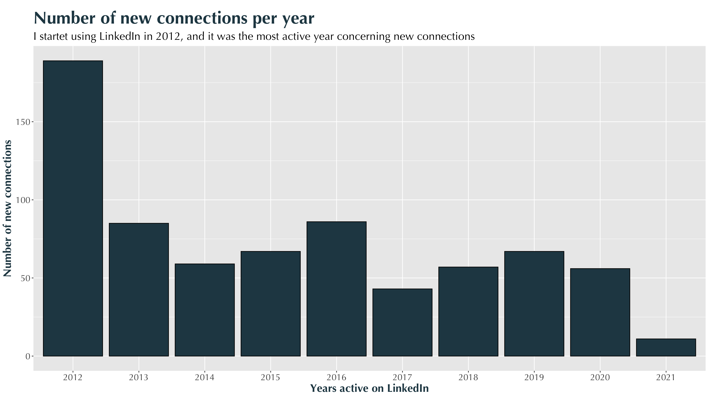
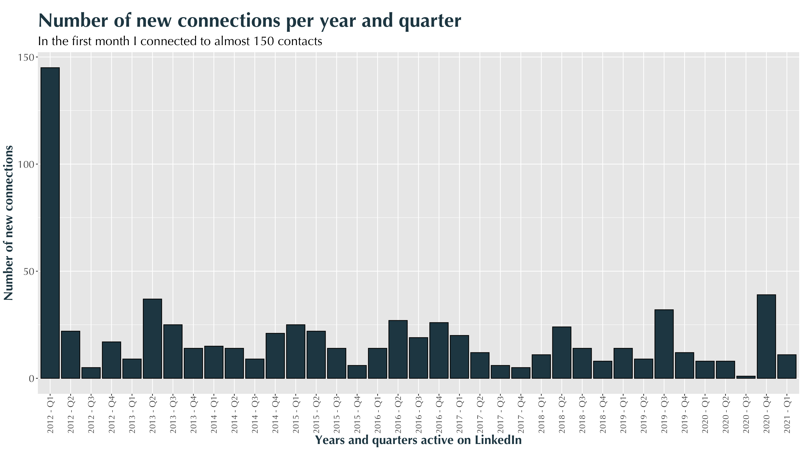
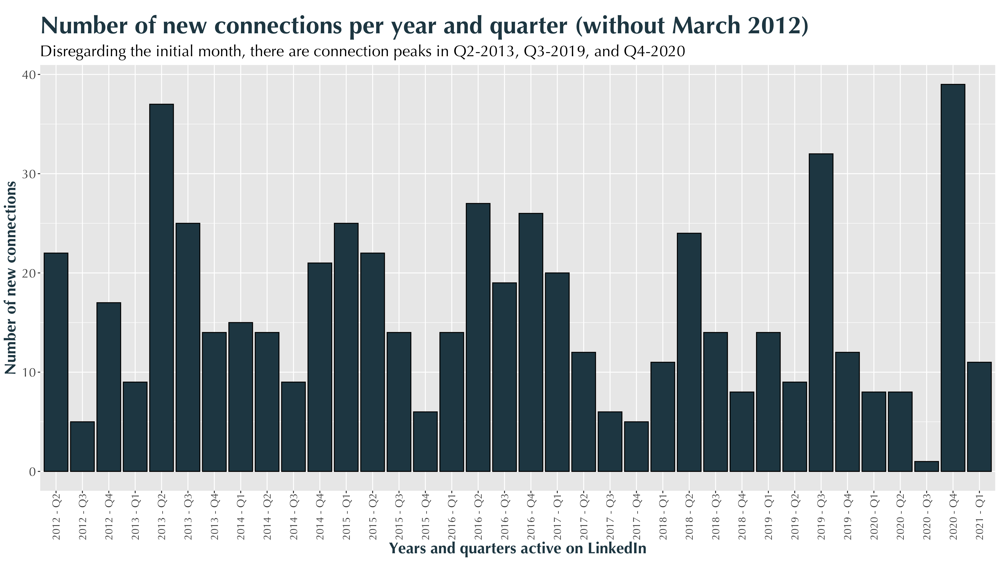
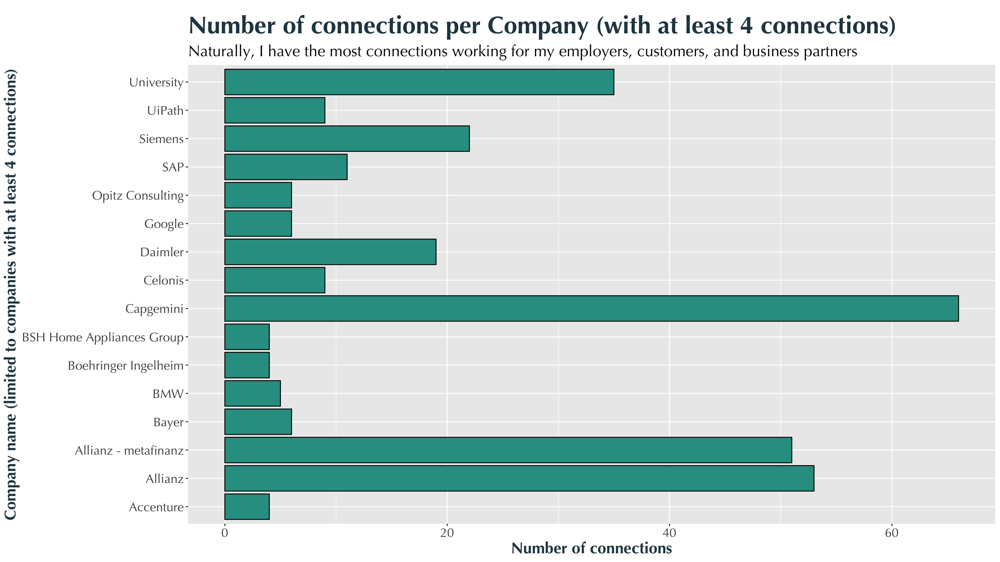
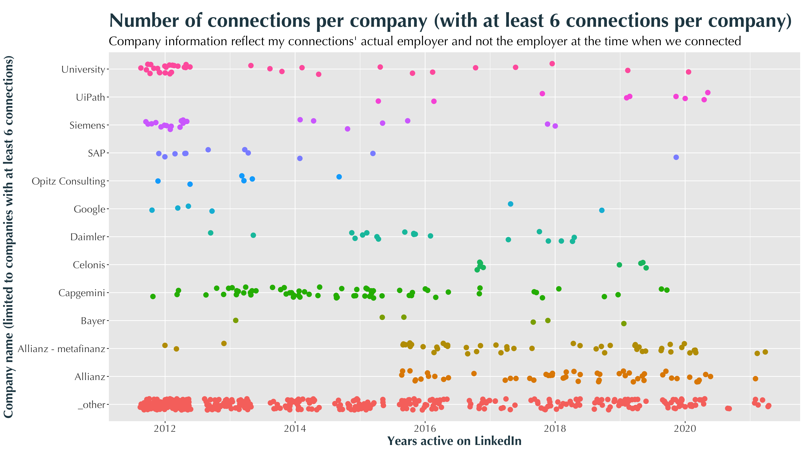
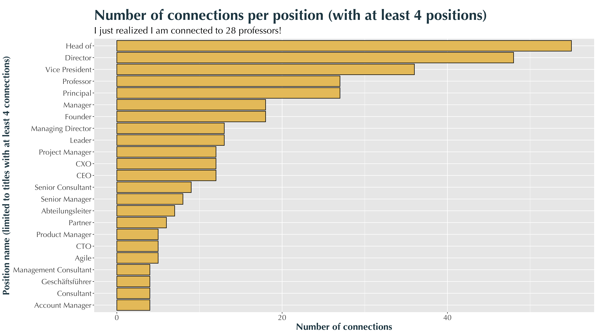
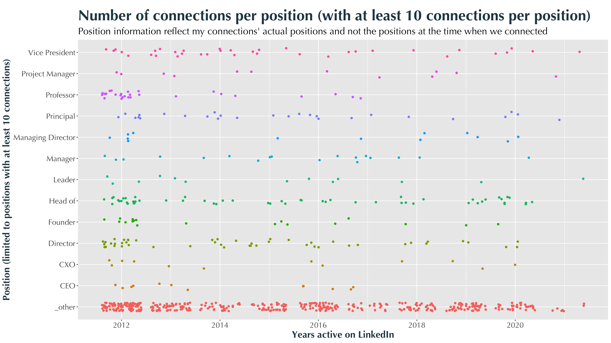
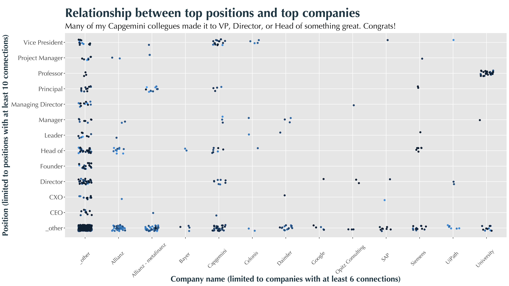

# Nine years on LinkedIn in data

> You will learn how to analyse your LinkedIn connection data using R, ggplot2, and dpylr.

## Motivation

**March 15th, 2021** marks my ninth year on LinkedIn. [I joined LinkedIn](https://www.linkedin.com/in/gscheithauer/) not at the beginning of my professional life, but nine years represent the better part of me working. I was a researcher with **Siemens CT** before I went into the **consulting business** in 2011, where I am still active. Looking back, my consisting topics are **process management** and **data science** - topics I really enjoy. Since joining LinkedIn in 2012 I made 720 virtual connections 😯. 

Some weeks ago I was reading [Richard's article](https://medium.com/@richardcsuwandi?source=post_page-----24df63a9dc28--------------------------------) about **analysing his own LinkedIn data**. And of course it made me curious about my own LinkedIn connections. Since he used **python and pandas** - which is a wonderful choice - I made the conscious decision to use **R** together with the packages **ggplot2** and **dplyr,** just to show you something new and to dust my R skills.  

If you want to follow along, please do using this git-repo: [https://github.com/scheithauer/r-LinkedInConnections](https://github.com/scheithauer/r-LinkedInConnections) Please note, that I am not disclosing my own connection data, but I will show you how to get your own data on LinkedIn.

## Technical setup

### R

I use the following tools necessary for you to follow along:

- R: 
[https://cran.r-project.org/mirrors.html](https://cran.r-project.org/mirrors.html)
- RStudio (Free version)
[https://rstudio.com/products/rstudio/download/](https://rstudio.com/products/rstudio/download/)

### Getting the data

Follow this link: [https://www.linkedin.com/psettings/member-data](https://www.linkedin.com/psettings/member-data) 

There you will find a section labeled **Get a copy of your data**. Select the second option and within it the **connections** option. After you click **request archive** and waiting some minutes, you should receive an email that you may download the data. 

After the download you should have this file: **Connections.csv**.

### Project structure

I structured my project like this (but please feel free to structure it any way you want).

- 01-data
    - Connections.csv
- 02-scripts
    - 01-data cleansing.R
    - 02-data visualization.R
- 03-graphs
    - *all the resulting graphs are stored here*
- LICENSE
- README.me

## Getting the data ready for analysis

When you open the **Connections.csv** you will see that LinkedIn allowed for the following data fields:

- First Name,
- Last Name,
- Email Address,
- Company,
- Position,
- Connected On

**The goal of data cleansing is the following:**

1. Get rid of the data fields that we will not need, i.e. name and email information
2. Expand the date information (Connected On)
    1. Year
    2. Year Quarter
    3. Year Month
    4. Day of week
3. Write the cleaned data into a new file

### Install and use necessary packages

```r
install.packaes("tidyverse", "lubridate", "readr") # https://www.tidyverse.org 
library(tidyverse)
library(lubridate)
library(readr)
```

### Read data and remove unecessary data fields

```r
li_cons <- read_csv("./01-data/Connections.csv", skip = 2) # skip = 2 since there is some text above the data

# remove columns First and Last name as well as Email address, 
# since they will not be analyzed
li_cons <- li_cons %>% 
  select("Company", "Position", "Connected On")
```

### Expand the date information

```r
# fix the date (change type from <chr> to <date>)
# Anyone who knows how to do this in a Tidyverse manner?
li_cons["connectedOn"] <- lapply(li_cons["Connected On"], function (x) {parse_date(x, "%d %b %Y")})

# generate columns for year, month, and day of the week
li_cons <- li_cons %>% 
  mutate(
    connectedOnYear = year(connectedOn),
    connectedOnMonth = formatC(month(connectedOn), width = 2, flag = "0"), # formatC is used to get a leading zero on month numbers
    connectedOnYearMonth = paste(connectedOnYear, connectedOnMonth, sep = "-"),
    connectedOnDay = formatC(day(connectedOn), width = 2, flag = "0"),
    connectedOnDOW = wday(connectedOn, label = TRUE, abbr = TRUE),
    connectedOnQuarter = quarter(connectedOn),
    connectedOnQuarterStr = paste(connectedOnYear, " - Q", connectedOnQuarter, sep = "")
  ) 
```

### Write cleaned data to disk

```r
# write cleansed data to disk
write_csv(li_cons, "./01-data/cleansed_Connections.csv")
```

That was it :-)

## Data exploration and visualizations

### Libraries

```r
library(tidyverse)
library(Hmisc)
library(ggthemes)
library(stringr)
```

### Some useful constants

```r
# my color palette
c_col <- c("#264653", "#2a9d8f", "#e9c46a", "#f4a261", "#e76f51")

# Theme information for ggplot2 graphs
theme_set(
  theme(
    text = element_text(size = 18,  family = "Optima"),
    plot.title = element_text(
      size = 28,
      hjust = 0,
      margin = margin(t = 10, r = 0, b = 10, l = 0, unit = "pt"),
      color = c_col[1],
      face = "bold"
    ),
    axis.title = element_text(
      size = 18,
      margin = margin(t = 10, r = 10, b = 10, l = 10, unit = "pt"),
      color = c_col[1],
      face = "bold"
    )
  )
)
```

### Cleaning company information

Company information is provided by LinkedIn users themselves. Hence, it should not be a surprise that this information is not necessary consistent and ready-to-use for at-once analysis. One might write **Google**, another **Google Inc.** or **Google LLC**. 

Please have a look at your data and possible different spellings:

```r
li_cons %>% 
  group_by(Company) %>% 
  summarise(
    n = n()
  ) %>% 
  arrange(Company) %>% 
  pull(Company)
```

The above code groups the company field and tells you the number of connections working for that company. Now you could make a decision to clean some of the data.

```r
# introduce a new variable
li_cons$comp_clean <- li_cons$Company

# Your magic here: 
li_cons <- li_cons %>% 
  mutate(
    comp_clean = if_else(str_detect(Company, "^Googe"), "Google", comp_clean),         # Whenever a company **starts** with Google, write it to just **Google**
    comp_clean = if_else(str_detect(Company, "Hochschule"), "University", comp_clean), # Whenever a company info contains the word (**Hochschule**) change it to **University**
    comp_clean = if_else(str_detect(Company, "University"), "University", comp_clean),
    comp_clean = if_else(str_detect(Company, "Universität"), "University", comp_clean)
  )
```

And so on. Make as many or few consolidations as you see fit.

### Cleaning company information

The same holds true for the **position** data field. Please have a look at your data and possible different spellings:

```r
li_cons %>% 
  group_by(Position) %>% 
  summarise(
    n = n()
  ) %>% 
  arrange(Position) %>% 
  pull(Position)
```

```r
# introduce a new variable
li_cons$pos_clean <- li_cons$Position

# Your magic here: 
li_cons <- li_cons %>% 
  mutate(
    pos_clean = if_else(str_detect(Position, "^Director"), "Director", pos_clean),  # Look for positions that start with the word **director** and change it to just **director**
    pos_clean = if_else(str_detect(Position, "VP"), "Vice President", pos_clean)    # Look for **VP** and change it to **Vice President**
  )
```

And so on.

### How many new connections have I made every year?

```r
# connectedOn: show a bar chart with frequencies by year
li_cons %>% 
  ggplot() +
  geom_bar(
    aes(as.factor(connectedOnYear)),
    fill = c_col[1], color = "Black"
  ) +
  labs(
    title = "Number of new connections per year",
    subtitle = "I startet using LinkedIn in 2012, and it was the most active year concerning new connections",
    x = "Years active on LinkedIn",
    y = "Number of new connections"
  ) 

ggsave('./03-graphs/01 - connections per year.png', width = 16, height = 9)
```


### How many new connections have I made every month?

```r
# connectedOn: show a bar chart with frequencies by year and quarter
li_cons %>% 
  ggplot() +
  geom_bar(
    aes(connectedOnQuarterStr),
    fill = c_col[1], color = "Black"
  ) +
  labs(
    title = "Number of new connections per year and quarter",
    subtitle = "In the first month I connected to almost 150 contacts",
    x = "Years and quarters active on LinkedIn",
    y = "Number of new connections"
  ) +
  theme(axis.text.x = element_text(angle = 90, vjust = 0.5, hjust = 1, size = 12))

ggsave('./03-graphs/02 - connections per year-quarter.png', width = 16, height = 9)
```


### How many new connections have I made every month disregarding the first month after joining?

```r
# connectedOn: show a bar chart with frequencies by year and quarter
li_cons %>% 
  filter(connectedOnYearMonth != "2012-03") %>% 
  ggplot() +
  geom_bar(
    aes(connectedOnQuarterStr),
    fill = c_col[1], color = "Black"
  ) +
  labs(
    title = "Number of new connections per year and quarter (without March 2012)",
    subtitle = "Disregarding the initial month, there are connection peaks in Q2-2013, Q3-2019, and Q4-2020",
    x = "Years and quarters active on LinkedIn",
    y = "Number of new connections"
  ) +
  theme(axis.text.x = element_text(angle = 90, vjust = 0.5, hjust = 1, size = 12))

ggsave('./03-graphs/03 - connections per year-quarter without march 12.png', width = 16, height = 9)
```


### For which companies are my connections working for?

```r
# companies: show frequencies of top-most companies
li_cons %>% 
  group_by(comp_clean) %>% 
  summarise(
    n = n()
  ) %>% 
  drop_na() %>% 
  filter(n > 3) %>% 
  arrange(-n)  %>% 
  ggplot() +
  geom_col(
    aes(n, comp_clean),
    fill = c_col[2], color = "Black"
  ) +
  labs(
    title = "Number of connections per Company (with at least 4 connections)",
    subtitle = "Naturally, I have the most connections working for my employers, customers, and business partners",
    y = "Company name (limited to companies with at least 4 connections)",
    x = "Number of connections"
  ) 

ggsave('./03-graphs/05 - connections per top companies.png', width = 16, height = 9)
```


### Are there any peak moments with top-companies?

```r
# list of top companies, with at least 4 connections
li_top_companies <- li_cons %>% 
  group_by(comp_clean) %>% 
  summarise(
    n = n()
  ) %>% 
  arrange(n) %>% 
  drop_na() %>% 
  filter(n > 5) %>% 
  pull(comp_clean)

li_top_companies

li_cons <- li_cons %>% 
  mutate(
    is_top_company = ifelse(comp_clean %in% li_top_companies, TRUE, FALSE),
    top_company = ifelse(comp_clean %in% li_top_companies, comp_clean, "_other")
  )

li_cons %>% 
  #filter(is_top_company) %>% 
  ggplot() + 
  geom_jitter(
    aes(connectedOnYear, top_company, color = top_company),
    size = 3,
    height = 0.2
  ) +
  labs(
    title = "Number of connections per company (with at least 6 connections per company)",
    subtitle = "Company information reflect my connections' actual employer and not the employer at the time when we connected",
    y = "Company name (limited to companies with at least 6 connections)",
    x = "Years active on LinkedIn"
  ) +
  theme(legend.position = "none")

ggsave('./03-graphs/07 - top-companies by year.png', width = 16, height = 9)
```


### What are my connections' positions?

```r
# positions: show frequencies of top-most positions

# some reording based on frequency
levels4sorting <- li_cons %>% 
  group_by(pos_clean) %>% 
  summarise(
    n = n()
  ) %>% 
  arrange(n) %>% 
  drop_na() %>% 
  filter(n > 3) %>% 
  pull(pos_clean)

li_cons_topPositions <- li_cons %>% 
  filter(pos_clean %in% levels4sorting) 

li_cons_topPositions$pos_clean <- factor(li_cons_topPositions$pos_clean, levels = levels4sorting)  

li_cons_topPositions %>% 
  group_by(pos_clean) %>% 
  summarise(
    n = n()
  ) %>% 
  ggplot() +
  geom_col(
    aes(n, pos_clean),
    fill = c_col[3], color = "Black"
  ) +
  labs(
    title = "Number of connections per position (with at least 4 positions)",
    subtitle = "I just realized I am connected to 28 professors!",
    y = "Position name (limited to titles with at least 4 connections)",
    x = "Number of connections"
  ) 

ggsave('./03-graphs/06 - connections per top companies.png', width = 16, height = 9)
```


### Are there any peak moments with top-positions?

```r
# list of top positions, with at least 4 connections
li_top_pos <- li_cons %>% 
  group_by(pos_clean) %>% 
  summarise(
    n = n()
  ) %>% 
  arrange(n) %>% 
  drop_na() %>% 
  filter(n > 9) %>% 
  pull(pos_clean)

li_top_pos

li_cons <- li_cons %>% 
  mutate(
    is_top_pos = ifelse(pos_clean %in% li_top_pos, TRUE, FALSE),
    top_pos = ifelse(pos_clean %in% li_top_pos, pos_clean, "_other")
  )

li_cons %>% 
  ggplot() + 
  geom_jitter(
    aes(connectedOnYear, top_pos, color = top_pos),
    height = 0.2
  ) +
  labs(
    title = "Number of connections per position (with at least 10 connections per position)",
    subtitle = "Position information reflect my connections' actual positions and not the positions at the time when we connected",
    y = "Position (limited to positions with at least 10 connections)",
    x = "Years active on LinkedIn"
  ) +
  theme(legend.position = "none")

ggsave('./03-graphs/08 - top-positions by year.png', width = 16, height = 9)
```



### Where are the top-positions working at the moment?

```r
# show relationship of top positions and top companies

li_cons %>% 
  ggplot() +
  geom_jitter(
    aes(top_company, top_pos, color = connectedOnYear),
    height = 0.2, width = 0.2
  ) +
  labs(
    title = "Relationship between top positions and top companies",
    subtitle = "Many of my Capgemini collegues made it to VP, Director, or Head of something great. Congrats!",
    y = "Position (limited to positions with at least 10 connections)",
    x = "Company name (limited to companies with at least 6 connections)"
  ) +
  theme(legend.position = "none") +
  theme(axis.text.x = element_text(angle = 45, vjust = 0.5, hjust = 0.6, size = 12))

ggsave('./03-graphs/09 - top-positions by top companies.png', width = 16, height = 9)
```


## Conclusion

Thanks to the EU's [General Data Protection Regulation (GDPR)](https://en.wikipedia.org/wiki/General_Data_Protection_Regulation) and especially the right to **information and access** allowed me to download and analyze my connection data from LinkedId. 

One could argue how useful such an analysis would be for anyone or me. It did not show too many surprises - but that is something I did not know before I made the effort. It was definitely fun and a drive on memory lane :-)

What I got out of this work was definitely an **exercise for my R skills** as well as **getting more friendly with using Git**.

Please feel free to reach out to me if you have ideas to improve this solution! 

All the best,
Gregor

https://github.com/scheithauer/r-LinkedInConnections


## Helpful resources for along the way

1. [https://happygitwithr.com/rstudio-git-github.html](https://happygitwithr.com/rstudio-git-github.html)
2. [https://dplyr.tidyverse.org/reference/mutate.html](https://dplyr.tidyverse.org/reference/mutate.html)
3. [https://coolors.co/palettes/trending](https://coolors.co/palettes/trending) 
4. [https://medium.com/@gscheithauer/data-visualization-in-python-like-in-rs-ggplot2-bc62f8debbf5](https://medium.com/@gscheithauer/data-visualization-in-python-like-in-rs-ggplot2-bc62f8debbf5)
5. [https://sebastiansauer.github.io/dplyr_filter/](https://sebastiansauer.github.io/dplyr_filter/)
6. [https://github.com/scheithauer/r-LinkedInConnections](https://github.com/scheithauer/r-LinkedInConnections)

